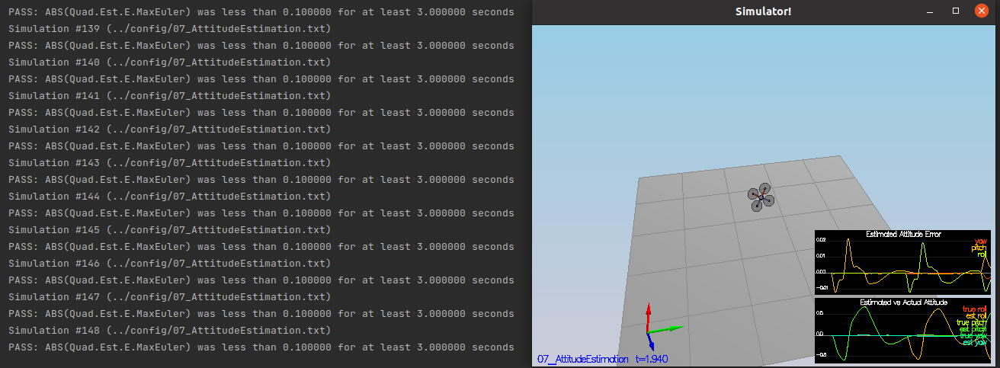

# Writeup: Building an Estimator

## Implement Estimator

### Determine the standard deviation of the measurement noise

This task required updating the parameters `MeasuredStdDev_GPSPosXY`
and `MeasuredStdDev_AccelXY` from the `06_SensorNoise.txt`.
The original values (`.2` and `.1`) do not reflect the data stored
in `Graph1.txt` and `Graph2.txt`.

To obtain the true standard deviation values, I opened each file on
LibreOffice Calc --- a spreadsheet software --- and used the `STDEV` function
to calculate the standard deviation of the data points stored
in `Graph1.txt` and `Graph2.txt`.
Then, I plugged the values I obtained (`MeasuredStdDev_GPSPosXY = 0.686946473091773` and 
`MeasuredStdDev_AccelXY = 0.496309757154396`) into `06_SensorNoise.txt`.
As seen in the Flight Evaluation section, these values satisfied the requirements.

### Implement a better rate gyro attitude integration scheme

I implemented the **nonlinear complimentary filter** described in Section 
7.1.2 of the ''Estimation for Quadrotors'' document.
To this end, we did the following extensions to the `QuadEstimatorEKF::UpdateFromIMU`
method:

1. I defined the quaternion q<sub>t</sub> on variable `quaternion`, containing the euler angles for
   $\phi$, $\theta$ and $\psi$ using:

```c++
float estimatedRoll = rollEst;
float estimatedPitch = pitchEst;
float estimatedYaw = ekfState(6);

Quaternion<float> quaternion = Quaternion<float>::FromEuler123_RPY(estimatedRoll, estimatedPitch, estimatedYaw);
```

2. I also stored the measured angular rates from IMU in the variable 
`bodyRates`:

```c++
V3D bodyRates = gyro;
```
3. Finally, I obtain predicted quaternion qbar<sub>t</sub> using:

```c++
quaternion.IntegrateBodyRate(bodyRates, dtIMU);
```

This function uses quaternions instead of the required $\phi$, $\theta$ and $\psi$ Euler angles. 
You can check the `QuadEstimatorEKF::UpdateFromIMU` method for details on how to obtain
these values from the `quaternion` instance.

### Implement all of the elements of the prediction step

### Implement the magnetometer update

### Implement the GPS update


## Flight Evaluation

### Step 1: Sensor Noise


### Step 2: Attitude Estimation




