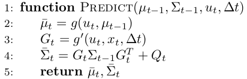
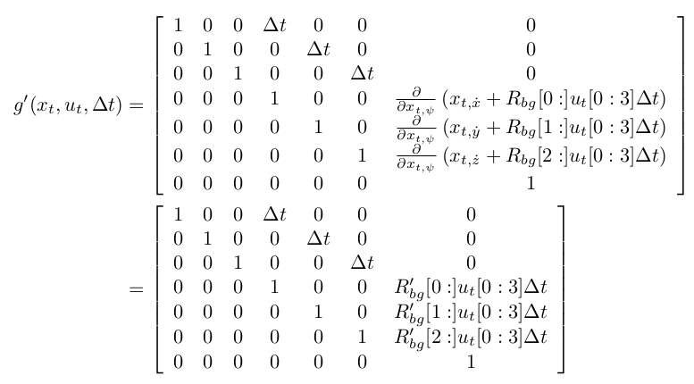
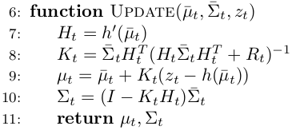
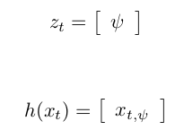
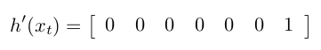
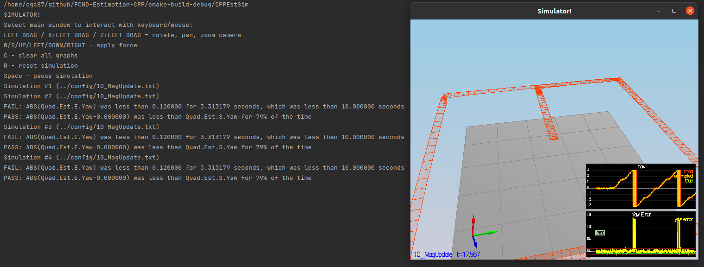

# Writeup: Building an Estimator

## Implement Estimator

### Determine the standard deviation of the measurement noise

This task required updating the parameters `MeasuredStdDev_GPSPosXY`
and `MeasuredStdDev_AccelXY` from the `06_SensorNoise.txt`.
The original values (`.2` and `.1`) do not reflect the data stored
in `Graph1.txt` and `Graph2.txt`.

To obtain the true standard deviation values, I opened each file on
LibreOffice Calc --- a spreadsheet software --- and used the `STDEV` function
to calculate the standard deviation of the data points stored
in `Graph1.txt` and `Graph2.txt`.
Then, I plugged the values I obtained (`MeasuredStdDev_GPSPosXY = 0.686946473091773` and 
`MeasuredStdDev_AccelXY = 0.496309757154396`) into `06_SensorNoise.txt`.
As seen in the Flight Evaluation section, these values satisfied the requirements.

### Implement a better rate gyro attitude integration scheme

I implemented the **nonlinear complimentary filter** described in Section 
7.1.2 of the ''Estimation for Quadrotors'' document.
To this end, we did the following extensions to the `QuadEstimatorEKF::UpdateFromIMU`
method:

1. I defined the quaternion q<sub>t</sub> on variable `quaternion`, containing the euler angles for
   &Phi; , &Theta; and &Psi; using:

```c++
float estimatedRoll = rollEst;
float estimatedPitch = pitchEst;
float estimatedYaw = ekfState(6);

Quaternion<float> quaternion = Quaternion<float>::FromEuler123_RPY(estimatedRoll, estimatedPitch, estimatedYaw);
```

2. I also stored the measured angular rates from IMU in the variable 
`bodyRates`:

```c++
V3D bodyRates = gyro;
```
3. Finally, I obtain predicted quaternion qbar<sub>t</sub> using:

```c++
quaternion.IntegrateBodyRate(bodyRates, dtIMU);
```

This function uses quaternions instead of the required &Phi; , &Theta; and &Psi; Euler angles. 
You can check the `QuadEstimatorEKF::UpdateFromIMU` method for details on how to obtain
these values from the `quaternion` instance.

### Implement all of the elements of the prediction step

#### Implement the state prediction step
For this task, I completed the `QuadEstimatorEKF::PredictState`.
Given a starting state x<sub>t</sub> (`startingState`), a time step $\Delta t$
(`timeStep`), and current accelerations u<sub>t</sub> (`accelerationBodyFrame`), I obtained the state
forward x<sub>t + 1</sub> (`predictedState`).

To obtain the elements on x<sub>t + 1</sub> regarding x, y, and z, coordinates;
the integration can be done relying on x<sub>t</sub> velocity
information. 
For example, to obtain the x coordinate element in x<sub>t + 1</sub>, I do the following:

```c++
int xCoordinateIndex = 0;
int xVelocityIndex = 3;
predictedState(xCoordinateIndex) = startingState(xCoordinateIndex) +
                                 startingState(xVelocityIndex) * timeStep;
```
We follow a similar logic for y, and z coordinates. You can check the
`QuadEstimatorEKF::PredictState` for additional details.

To obtain the velocity elements of x<sub>t + 1</sub>, I obtained first the acceleration
on the inertial frame (`accelerationInertialFrame`), considering gravity. 
In code, it goes like this:

```c++
 V3F gravity = V3F(0, 0, -9.81f);
 V3F accelerationInertialFrame = attitude.Rotate_BtoI(accelerationBodyFrame) + gravity;
```

Once I have a value for `accelerationInertialFrame`, I can use it to integrate the velocity
elements of x<sub>t + 1</sub>.
For example, the velocity in the x coordinate element on x<sub>t + 1</sub>
is obtained with:

```c++
 predictedState(xVelocityIndex) = startingState(xVelocityIndex) +
                                  accelerationInertialFrame.x * timeStep;
```

We follow a similar logic for obtaining the velocity in the y coordinate.
For velocity in the z coordinate, to include gravity I do:

```c++
int zVelocityIndex = 5;
 predictedState(zVelocityIndex) = startingState(zVelocityIndex) +
                                  accelerationInertialFrame.z * timeStep -
                                  CONST_GRAVITY * dt;
```

#### Calculate the partial derivative of the body-to-global rotation matrix
The Rprime<sub>bg</sub> (`RbgPrime`) I obtain in the `QuadEstimatorEKF::GetRbgPrime` 
method is a
C++ translation of Formula 52 of the ''Estimation for Quadrotors'' document.
On page 9, its stated that:


Where &Phi; corresponds to roll, &Theta; corresponds to pitch,
and &Psi; corresponds to yaw.
In code, I implement this mapping using:

```c++
float phi = roll;
float theta = pitch;
float psi = yaw;
```

Then, to populate Rprime<sub>bg</sub> the code goes like this:

```c++
float firstRowFirstColumn = -cos(theta) * sin(psi);
RbgPrime(0, 0) = firstRowFirstColumn;
```
I follow a similar logic for the rest of the matrix elements.
Please check `QuadEstimatorEKF::GetRbgPrime` for further detail.

#### Predict the state covariance forward
On Algorithm 2 from the ''Estimation for Quadrotors'' document,
the ''Predict'' functions does the following:



On the `QuadEstimatorEKF::Predict` method, the goal is to predict
the covariance &Sigma;<sub>t</sub> (`newCovarianceMatrix`).
According to Algorithm 2, to calculate &Sigma;<sub>t</sub>, we need to obtain first g' (`gPrime`). 
At equations 50-51 from the ''Estimation for Quadrotors'' document,
g' value is:



The matrix elements depend on the time step &Delta;t (`timeStep`),
the Rprime<sub>bg</sub> matrix(`RbgPrime`), and the vehicle acceleration 
u<sub>t</sub> (`vehicleAcceleration`).
For example, to populate the g' element located at the fourth row-seventh
column, I do the following:

```c++
float gPrimeFourthRowSeventhColumn = (RbgPrime(0) * vehicleAcceleration).sum() * timeStep;
gPrime(3, 6) = gPrimeFourthRowSeventhColumn;
```
The rest of elements of g' follow a similar logic. 
Check `QuadEstimatorEKF::GetRbgPrime` for further detail.
Once g' is ready, we can translate line 4 of Algorithm 2 with the
following code:

```c++
MatrixXf currentCovarianceMatrix = ekfCov;
MatrixXf newCovarianceMatrix = gPrime * currentCovarianceMatrix * gPrime.transpose() + Q;
ekfCov = newCovarianceMatrix;
```

As part of this step, we also updated the `QPosXYStd` and `QVelXYStd`
parameters from `QuadEstimatorEKF.txt`. 
To check the tuning results, please refer to the plots in the 
"Flight Evaluation" section.

### Implement the magnetometer update

On Algorithm 2 from the ''Estimation for Quadrotors'' document,
the ''Update'' functions does the following:



My work on the `QuadEstimatorEKF::UpdateFromMag` method was focused
on obtaining the measurement z<sub>t</sub> (`z`), the jacobian
of the observation function h'(`hPrime`), and the measurement
prediction &mu;<sub>t</sub> (`zFromX`).

On Section 7.3.2 of he ''Estimation for Quadrotors'' document,
the measurement z<sub>t</sub> and the estimated yaw h(x<sub>t</sub>)
have the following values:



Where &Psi; (`magYaw`) is the yaw reading from the magnetometer,
and x<sub>t, &Psi;</sub> (`estimatedYaw`) is the current estimated yaw.
In code, we implement this with:

```c++
VectorXf z(1);
z(0) = magYaw;
float estimatedYaw = ekfState(6);
```

In the same section, the jacobian
of the observation function h' has the value:



In C++ code, this translates to:

```c++
MatrixXf hPrime(1, QUAD_EKF_NUM_STATES);
hPrime.setZero();
hPrime(0, 6) = 1;
```
Regarding the measurement prediction &mu;<sub>t</sub>,
to normalise the difference between measured yaw z<sub>t</sub>; and 
estimated yaw h(x<sub>t</sub>) I used the following code:

```c++
 float measurementPrediction = estimatedYaw;
 float yawDifference = measuredYaw - estimatedYaw;
 if (yawDifference > F_PI) {
     measurementPrediction += +2.f * F_PI;
 } else if (yawDifference < -F_PI) {
     measurementPrediction -= -2.f * F_PI;
 }

 zFromX(0) = measurementPrediction;
```


### Implement the GPS update


## Flight Evaluation

### Step 1: Sensor Noise


### Step 2: Attitude Estimation


### Step 3: Prediction Step

#### Scenario 8


#### Scenario 9


### Step 4: Magnetometer Update



